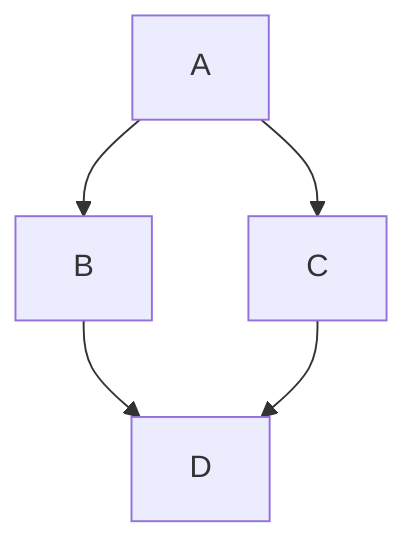

# shakaflee.github.io

edit here will show on my webpage 2022-10-13 01:37

## Learning: Basic writing and formatting on github 
2022-10-14 18:12:00

### 1. heading
use one to six `#` before text, the more `#` you use, the small size your heading.

**Code Sample**:

```
# heading 1
## heading 2
### heading 3
```

**will produce:**

# heading 1
## heading 2
### heading 3

**on github, two or more heading you use, github will automatically generate a table of content which help you navagate quickly.**

### 2. styling text
to indicate emphasis, use 

**Code Sample**:

```
- **bold**
- *Italic* or _Italic_
- ~~strickthrough~~
- normal <sub>subscript</sub>
- normal <sup>supperscript</sup>,
- ***all bold and italic***
- **bold and nested _italic_**
```

**will produce:**

- **bold**
- *Italic* or _Italic_
- ~~strickthrough~~
- normal <sub>subscript</sub>
- normal <sup>supperscript</sup>,
- ***all bold and italic***
- **bold and nested _italic_**

### 3. quoting text
use symbol `>` before your text

**Code Sample**:

```
>this is quote
```

**will produce:**
 
>this is quote

### 4. quoting code
use single backkicks to call out,like: 

**Code Sample**:

```
this is a `code` sentence.
```

**will produce:**

this is a `code` sentence.

use triple backkicks to format text into a distince block, like:

**Code Sample**:

````
```
this is a code sentence.
```
````

**will produce:**

```
this is a code sentence.
```

**Note 1**: text in quote will not change.

**Note 2**: to show  `` ``` `` above,I use 4 `` ` `` outer here. which I found at [Creating and highlighting code blocks.](https://docs.github.com/en/get-started/writing-on-github/working-with-advanced-formatting/creating-and-highlighting-code-blocks)

**Note 3**: to show `` ``` `` or `` ` `` in Note 2, fist enter 2 `` ` `` followed with **a space** , then enter 3 or 1 `` ` `` followed with **a space**, end with 2 `` ` ``.

### 5. supported color mode (only in issue,pull request and discussion)
use single backkicks to quote color to display the color.

**Code Sample**:

```
like this `rgb(25,26,145)`
```

**will produce:**


`rgb(25,26,145)`


**Fail** to show here because like I mentioned above, this is only for issue,pull request and discussion.

### 6. Links
create a an inline link by wrapping link text in `[]`,and then use `()` wrapping the URL.

**Code Sample**:

```
This is link to [Github basic writing and formatting pages](https://docs.github.com/en/get-started/writing-on-github/getting-started-with-writing-and-formatting-on-github/basic-writing-and-formatting-syntax)
```

**will produce:**

This is link to [Github basic writing and formatting pages](https://docs.github.com/en/get-started/writing-on-github/getting-started-with-writing-and-formatting-on-github/basic-writing-and-formatting-syntax)

### 7. section links
As github will use heading to auto build a table, you can just link directly to section by click the table list item, and also by hovering over on a section heading to expose the link.

### 8. relative link(in github)

**Code Sample**:

```
this link to [404.md](404.md)
```

**will produce:**

this link to [404.md](404.md)

**Note 1**: this file is in root dir which is same as this README.md location, if they are not, use `/` or `.` or type dir name to indicate.

### 9. Images
use a `!` to indicate here is an image, and use `[]` to wrap alt text, use `()`to link the image source.


**Code Sample**:

```

```

**will produce:**


**Note**: no space between file name, which I learned from this png file name, note there I use a `-` to link.

### 10. specifying a theme an image is shown on
use a HTML `<picture>` element and `prefers-color-scheme`.

**Code Sample**:

```
<picture>
  <source media="(prefers-color-scheme: dark)" srcset="https://user-images.githubusercontent.com/25423296/163456776-7f95b81a-f1ed-45f7-b7ab-8fa810d529fa.png">
  <source media="(prefers-color-scheme: light)" srcset="https://user-images.githubusercontent.com/25423296/163456779-a8556205-d0a5-45e2-ac17-42d089e3c3f8.png">
  
</picture>
```

**will produce:**

<picture>
  <source media="(prefers-color-scheme: dark)" srcset="https://user-images.githubusercontent.com/25423296/163456776-7f95b81a-f1ed-45f7-b7ab-8fa810d529fa.png">
  <source media="(prefers-color-scheme: light)" srcset="https://user-images.githubusercontent.com/25423296/163456779-a8556205-d0a5-45e2-ac17-42d089e3c3f8.png">
  
</picture>

### 11. lists
use `*` or `-` for **unordered list**.

use number for **ordered list**.

### 12. nested list(use `Tab` for indent and `Shift + Tab` for dedent)

**Code Sample**:

```
1. this is first 
   - second
   - third
     - fouth
```

**will produce:**

1. this is first 
   - second
   - third
     - fouth
  
### 13. task list
preface a hyphen `-` and space followd by `[ ]`,to mark a task as completed use `[x]`.
 
**Code Sample**:
 
 ```
 - [x] this is done.
 - [ ] this is **not** done.
 - [ ] \(use `\` when begin with parenthesis `\`)
 ```
 
**will produce:**
 
 - [x] this is done.
 - [ ] this is **not** done.\
 - [ ] \(use `\` when begin with parenthesis `\`)

### 14. mention people and team (use `@`)

### 15. reference issue and pull request (use `#`)

### 16. reference external resource(Not learned)

### 17. upload assets(just drag and drop, select from your browser)

### 18. use emoji
use with `:` followed by emojicode,and use `Tab` or `Enter` to complete.

**Code Sample**:
 
```
this is :+1
``` 

**will produce:**
 
this is 👍

### 19. paragraphs
create a new para by leaving a blank line between lines of text.

### 20. footnote
**note**:foot note will always show at the bottome of markdown so no need worry about where you put footnoot.

**Code Sample**:

```
here is footnote[^1].

here is another footnote[^2].

[^1]:my ref,**note** with 2 space after `.`.  
[^2]:Every new line should be prefixed with 2 spaces,so **note** this line end with two space after `.`.    
This allows you to have a footnote with multiple lines, **note** this line end with two space after `.` too.  
third line.
```

**will produce:**

here is footnote[^1].

here is another footnote[^2].

[^1]:my ref,**note** with 2 space after `.`.  
[^2]:Every new line should be prefixed with 2 spaces,so **note** this line end with two space after `.`.    
This allows you to have a footnote with multiple lines, **note** this line end with two space after `.` too.  
third line.

### 21. hiding content with comment
use HTML comment

**Code Sample**:

```
<!-- this content will not appear in the rendered markdown -->
```

**will produce:**

<!-- this content will not appear in the rendered markdown -->

of course **Nothing**, but actually I do put the code here.

### 22. ignore markdown formatting(use `\`)

**Code Sample**:

```
let's rename \*old name\* to \*new name\*
```
**will produce:**

let's rename \*old name\* to \*new name\*

More info about this can [click here.](https://daringfireball.net/projects/markdown/syntax#backslash)

### 23. disable markdown rendering when you view a markdown file by clicing `<>` at the top of the file, so you can view source.

## end this learning jourey here.


## Learning: Advanced formatting on github 
2022-10-21 11:10:00

### 1. create a table
use pipe `|`, hyphens `-`, colons `:`

- `|` for seperate column;
- `-` for create table header;
- `:` for aligh text for that column;

**Code Sample**:

```
| header 1|header 2|header 3|
|:---|:---:|---:|
|cell 1,this will **align left**|cell 2,**align center**|cell3,**align right**|
|cell 4,no worry about each cell txet length|cell 5|cell 6|
```
**will produce:**

| header 1|header 2|header 3|
|:---|:---:|---:|
|cell 1,this will **align left**|cell 2,**align center**|cell3,**align right**|
|cell 4,no worry about each cell text length|cell 5|cell 6|

**Note 1**: you can format text in table too, there at least 3 `-` to create a header.

### 2. create a collapsed section
this will only show content when user click to see.

use `<details>` block,

**Code Sample**:

````
<details><summary>click to show more</summary>

#### this will hide.
```
show quote code here.
```
</details>
````

**will produce:**

<details><summary>click to show more</summary>

#### this will hide.
```
show quote code here.
```
</details>

**note 1**: if there is no `<summary>` tag then `click to show more` will be content, not the title.

### 3. create code block
as mentioned in **basic writing and formatting on gihub - quote code**,use 3 `-` to fence.

and add a language for Syntax highlighting.

**Code Sample**:

````
```ruby
require 'redcarpet'
markdown = Redcarpet.new("Hello World!")
puts markdown.to_html
```
````

**will produce:**

```ruby
require 'redcarpet'
markdown = Redcarpet.new("Hello World!")
puts markdown.to_html
```

github will detect the language.

### 4. create diagram
add word inside fenced block to identify.

**Code Sample**:

````
Here is a simple flow chart:


````

**will produce:**

Here is a simple flow chart:


here use keyword `mermaid` to identify.

### 5. writing mathematical expression
use `$` delimit expression.

**Code Sample**:

```
this is math $\sqrt{3}$
```

**will produce:**

this is math $\sqrt{3}$

also use `math` inside fenced block to identify this is a math expression to avoid use `$`,or you can use `$$`.

**Code Sample**:

````
```math
\sqrt{3}
```
or

$$\sqrt{3}$$
````

**will produce:**

```math
\sqrt{3}
```
or

$$\sqrt{3}$$

well here comes out an error when use `` ```math `` and I don't konw why,so maybe just use `$$` now.

when use `$` outside of a math expression ,use `<span>$</span>`.

**Code Sample**:

```
here is <span>$</span>100 , and here is $\sqrt{3}$
```

**will produce:**

here is <span>$</span>100 , and here is $\sqrt{3}$

### 6. auto linked reference

**Code Sample**:

```
visit https://github.com
```

**will produce:**

visit https://github.com

and for ref to issue,pull request etc. use `#`

### 7. attaching file

### 8. links to code
for a permanent link to code, [click to see the way](https://docs.github.com/en/get-started/writing-on-github/working-with-advanced-formatting/creating-a-permanent-link-to-a-code-snippet)

for link to a markdown file with no render,use `?plain=1` at the end of the url,and with `#L` you can link to a certain line.

### 9. use keyword in issue and pull request.
use `close` or `fix` or `reslove` or `duplicate of`

## end this learning journey here.
